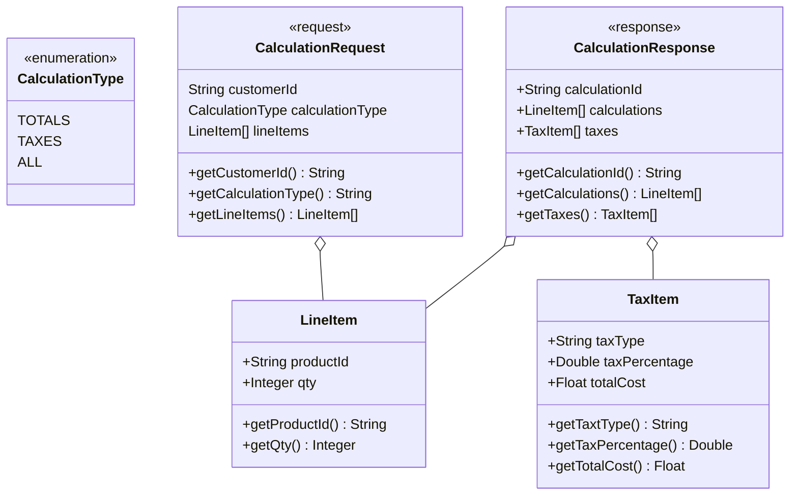

# Grocery Price API

API that turns a function into a resource. Also used to sample the Atlassian Compass tool as a developer portal.

## How it works

Our resource is the `PriceCalculator`. It somewhat emulates a graph mutation taking an Input (`CalculationRequest`) and returning values that complete the resource of a calculation.

When making a request, the value of the `CalculationType` must be one of:

* Totals
* Taxes
* All (Totals and Taxes)
